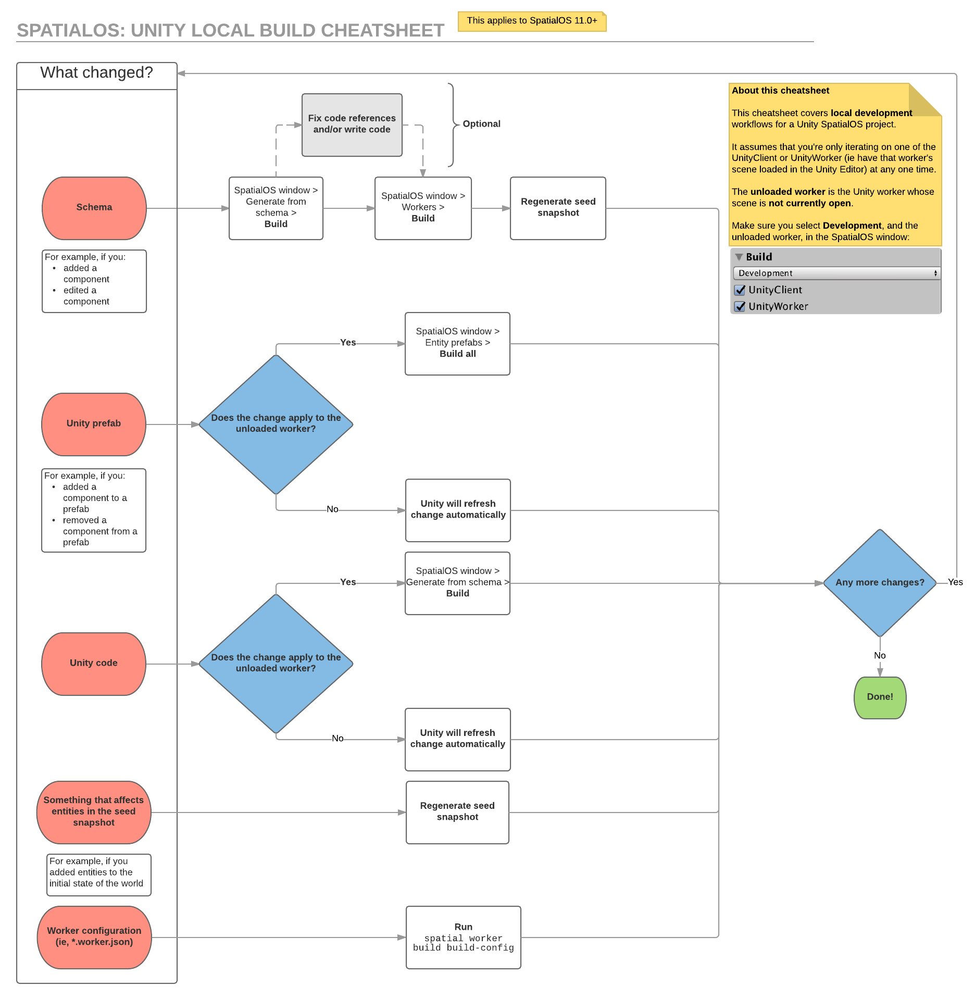

# Building in Unity: what and when to build

> A new build system (currently in **beta**) was introduced in SpatialOS 12.2. This page is about the system that existed before that. To try out the new system, see [Using the new build system](../customize/minimal-build.md).

This page is about building in the Unity Editor. If you want to build from the command line, see
[Building from the command line (SpatialOS documentation)](https://docs.improbable.io/reference/13.0/shared/build).

## Quick reference

If you've modified the **schema** files you have to:

* [regenerate the helper classes from the schema](#if-you-ve-changed-the-schema)

If you've modified a **prefab** you have to:

* [export all entity prefabs](#if-you-ve-modified-a-prefab)

If you've modified **Unity code** you have to:

* [build the workers](#if-you-ve-changed-unity-code)
* [regenerate the initial snapshot](#updating-the-initial-snapshot) (if affected,
  e.g. by modifying snapshot generating code, or entity templates for entities
  in the snapshot)

> **Build and run**
>
> When you see the expression "build and run" in a tutorial or recipe, it means that you should:

> 1. build your project following the advice on this page<
> 1. start SpatialOS locally (`Window > SpatialOS`, `Build` tab, and `Run SpatialOS locally > Run`)
> 1. connect a client to SpatialOS, e.g. by playing the UnityClient scene in the Unity Editor

## Build target

Building prefabs and workers is target dependent. There's two targets:

* development: builds for local deployment - it builds both the UnityWorker and UnityClient for your current OS.
* deployment: builds for cloud deployment - it builds the UnityWorker for Linux, and UnityClients for both Windows and
macOS OS.

There's a dropdown to switch the build target in the [SpatialOS window](../reference/spatialos-window.md), on the `Build` tab.

To configure target platforms when building for development and deployment, see
the [Build configuration](../customize/configure-build.md#build-configuration) section in the [Configuring the build process](../customize/configure-build.md) page.

## If you’ve changed the schema

**Any time** you change the [schema]
(https://docs.improbable.io/reference/13.0/shared/glossary#schema) (for example, add or
change a [component (SpatialOS documentation)](https://docs.improbable.io/reference/13.0/shared/glossary#component)),
you need to regenerate the [generated
code (SpatialOS documentation)](https://docs.improbable.io/reference/13.0/shared/glossary#code-generation), and fix
code references.

> Don't forget to keep your schema
[backwards-compatible (SpatialOS documentation)](https://docs.improbable.io/reference/13.0/shared/schema/evolution).

1. In the Unity Editor, open the [SpatialOS
window (SpatialOS documentation)](https://docs.improbable.io/reference/13.0/shared/glossary#unity-spatialos-window) (`Window
> SpatialOS`).
1. To generate the code for Unity to use, go to the `Build` tab, and under `Generate from schema`, click `Build`.
1. If there are any code references that are broken by the schema changes, fix
them and follow the [If you've changed Unity code](#if-you-ve-changed-unity-code)
section.

## If you've modified a prefab

You must **build prefabs** if you modify a prefab directly by:

* adding a component,
* removing a component, or
* changing a property on a component

To build prefabs, open the [SpatialOS window](../reference/spatialos-window.md) (`Window > SpatialOS`), go to the `Build` tab, and under `Entity prefabs`, click `Build all`.

## If you've changed Unity code

1. You must **build workers**. To build workers, open the [SpatialOS window](../reference/spatialos-window.md)
(`Window > SpatialOS`), go to the `Build` tab, and under `Workers`, click `Build`.

2. You have to [regenerate the initial snapshot](#updating-the-initial-snapshot) (if affected,
  e.g. by modifying snapshot generating code, or entity templates for entities
  in the snapshot)

> Prefabs are built as part of the workers' build process, so you don't need to separately build prefabs before building workers.

### Build from the command line

The SpatialOS window isn't the only way to build your project - you can also build using the [`spatial` command-line tool (SpatialOS documentation)](https://docs.improbable.io/reference/13.0/shared/spatial-cli-introduction).

1. Make sure the Unity Editor is closed.

    If it's not, it'll cause build errors.

2. In the root directory, to build workers for local deployment, run:

    [`spatial worker build UnityWorker UnityClient --target=development` (SpatialOS documentation)](https://docs.improbable.io/reference/13.0/shared/spatial-cli/spatial-worker-build).

    Or, to build workers for cloud deployment, run:

    [`spatial worker build UnityWorker UnityClient --target=deployment` (SpatialOS documentation)](https://docs.improbable.io/reference/13.0/shared/spatial-cli/spatial-worker-build).

## Updating the initial snapshot

You must update your [initial
snapshot (SpatialOS documentation)](https://docs.improbable.io/reference/13.0/shared/glossary#initial-snapshot) (or
generate a new one) if you make any changes that affect what's in the snapshot.
This includes (but isn't limited to):

* adding or removing entities in the initial state (by changing the code which
  adds them)
* changing the number of entities in the initial state (by changing the code
  which adds them)
* changing the template (used to spawn an entity) of any entity that's in the
  initial snapshot, including
  * adding components to the entity
  * removing components from the entity
  * changing the initial data of a component
  * changing per-component write access requirements

To update the initial snapshot, use the [C# SDK (SpatialOS documentation)](https://docs.improbable.io/reference/13.0/csharpsdk/using#snapshots) to manipulate it.

## Optimizing build times

You can decrease build times by taking the following points into consideration:

* When you run a scene in Unity's Editor, the worker corresponding to that scene doesn't need to be built beforehand. During development, you can skip building the open scene (often `UnityClient`) unless you intend to use the game executable.

* If you want to skip building for certain worker types (e.g. `UnityClient` in the case above), you can uncheck them in the `Build` tab of the [SpatialOS window](../reference/spatialos-window.md).

* Prefabs are built as part of the workers' build process, so you don't need to separately build prefabs before building workers.

## Unity building cheat sheet

For a handy guide to what to build when in Unity, see
[this cheat sheet](../assets/building/unitybuildcheatsheet.pdf):

