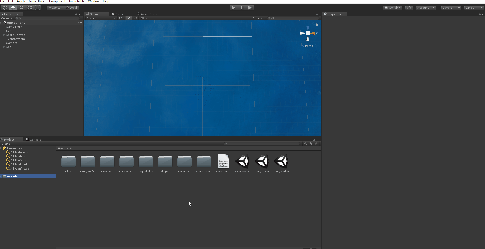
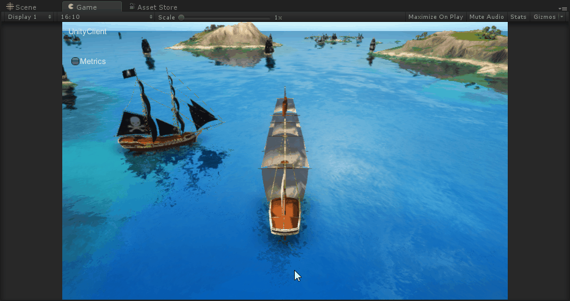
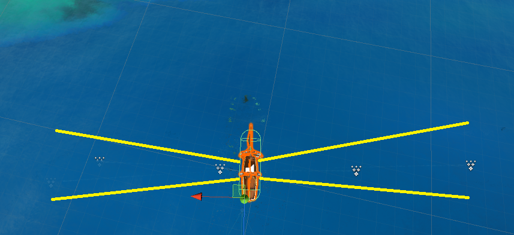
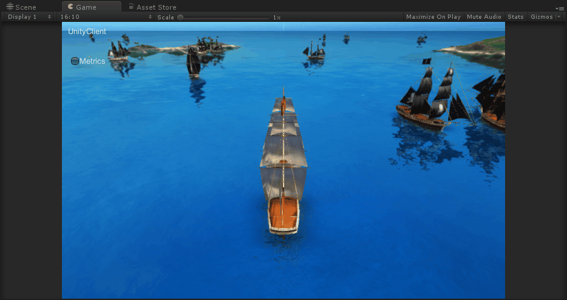

# Lesson 4 - Trigger a component event

In this lesson you will trigger a [component event (SpatialOS documentation)](https://docs.improbable.io/reference/13.0/shared/glossary#event)
based on a behaviour defined by your worker.
This event will cause pirate ships to shoot whenever there is another ship in
range of their cannons.

You will learn:

- how to trigger an event
- how to read the state of component properties
- how to use a library in a C++ worker

You will implement this logic in the same worker which is moving the pirate
ships. While there's nothing stopping you from creating another one and
separating this behaviour, too, remeber the principles for [designing
workers (SpatialOS documentation)](https://docs.improbable.io/reference/13.0/shared/design/design-workers#managed-workers). If you take
moving pirate ships and shooting pirate ships as two separate sub-systems, some
of the described downsides will apply. The two sub-systems would need to
communicate with each other very frequently and pretty much the same components
would be synchronized on both.

## 1. Extend the `ShipControls` component

In [lesson 3](../../tutorials/cpp-worker-tutorial/move-pirate-ships.md), you
sed the properties on the `ShipControls` component to move
pirate ships around. In this lesson, you're going to add something new to
`ShipControls`.

Components are defined in a project's **schema**. SpatialOS uses this schema to
generate code which workers use to read and write to components. It's written
in [schemalang (SpatialOS documentation)](https://docs.improbable.io/reference/13.0/shared/glossary#schemalang), and
it's located in the `schema` directory of the project.

1. From the project root directory, navigate to
   `schema/improbable/ship/ShipControls.schema`.

    This schema file is where `ShipControls` is defined.

2. Look at this file. At the moment, it contains two properties:
   `target_steering` and `target_speed`.

3. Add `FireLeft` and `FireRight` component events to this definition, like
   this:

    ```
    package improbable.ship;

    type FireLeft {}
    type FireRight {}

    component ShipControls {

      // ... CODE ... //

      // The component event for triggering firing cannonballs left.
      event FireLeft fire_left;
      // The component event for triggering firing cannonballs right.
      event FireRight fire_right;
    }
    ```

    The declarations for the `FireLeft` and `FireRight` types don't have any
    fields: they are empty objects. They _could_ store data that is
    synchronized when the events are triggered. For example, they could store
    the time at which the cannon was fired. Leave them empty for now.

4. You've changed the schema. Whenever you change schema, you need to
   regenerate the generated code.

    In the SpatialOS window, under `Build > Generate from schema`, click
    `Build`.

    This **generates code that Unity workers can use** to read and modify
    components, and allows SpatialOS to synchronize components across the
    system.

    To do the same for your C++ worker, run `spatial worker build
    PirateShipMovement --target=windows`. This task will firstly generate the
    new code and will then link it with your worker code.

## 2. Trigger the Fire events from your C++ worker

This step is similar to [Trigger the Fire events from the Unity Client](../../tutorials/pirates/lesson4.md#3-trigger-the-fire-events-from-the-unity-client)
from the Pirates tutorial. The `UnityClient` worker uses player input to decide when the event should be triggered.
Your C++ worker will need to decide this based on some pre-defined behaviour.

### Random shooting

In the simplest form of shooting, a pirate ship could randomly shoot and hope
it hits an enemy. This wouldn't be much different from the random movement you
already implemented in the last lesson. However, it will help you see how
events are triggered and you will also make sure the steps you did so far
actually work.

1. Open `startup.cc` and define two new updates in the `steering_update`
   function under the already existing update for steering that you used in the
   previous lesson:

    ```cpp
    // Holds each component update before sending it
    improbable::ship::ShipControls::Update steering_update;

    // Shooting event updates
    improbable::ship::ShipControls::Update fire_left_update;
    fire_left_update.add_fire_left(improbable::ship::FireLeft{});

    improbable::ship::ShipControls::Update fire_right_update;
    fire_right_update.add_fire_right(improbable::ship::FireRight{});
    ```

    > Sending updates about shooting from a function called `steering_update` is a
    bit abusive and your worker is starting to get a bit messy. Don't worry about
    this as random shooting is just a quick way to show you how shooting might
    work. You will clean up the code and implement smarter shooting soon.

2. In the loop that goes over all entities in the view, add the logic for
   triggering the shots. Do this after sending the steering update for each
   ship:

    ```cpp
    // Send the steering update to SpatialOS
    thread_safe_component_update<improbable::ship::ShipControls>(connection, entity_id, steering_update);

    // Shoot randomly with 20% probability in each direction
    auto random_shot = rand_float(0, 1);
    if (random_shot <= 0.2) {
        thread_safe_component_update<improbable::ship::ShipControls>(connection, entity_id, fire_left_update);
    } else if (random_shot >= 0.8) {
        thread_safe_component_update<improbable::ship::ShipControls>(connection, entity_id, fire_right_update);
    }
    ```

3. Rebuild your C++ worker to complete this step.

## 3. Add a `CannonFirer` to pirate ships

In order to visualise (and hear) the shots, you will need to make some changes
to the Unity project. This is how you will handle the event you triggered in
the previous step.

Copy the `Cannon` and `CannonFirer` components and the `AudioSource` for
cannons from the `PlayerShip` prefab to `PirateShip` as shown below:



Open `CannonFirer.cs` and add handlers for the `FireLeft` and `FireRight`
component events. The snippet below shows the complete script. This is an
example of handling a component event. Events are very similar to [component
properties (SpatialOS documentation)](https://docs.improbable.io/reference/13.0/shared/glossary#property).

> In fact, everything you can do with an event can also be done with a
property. What properties add on top of events is persistence - you can read
the current value of a property. When all you need is transient messaging
without persistence, events are a good choice over properties.

```cs
using UnityEngine;
using Improbable.Ship;
using Improbable.Unity.Visualizer;

namespace Assets.Gamelogic.Pirates.Cannons
{
    // This MonoBehaviour will be enabled on both client and server-side workers
    public class CannonFirer : MonoBehaviour
    {
        [Require] private ShipControls.Reader ShipControlsReader;
        private Cannon cannon;

        private void OnEnable()
        {
            ShipControlsReader.FireLeftTriggered.Add(OnFireLeft);
            ShipControlsReader.FireRightTriggered.Add(OnFireRight);
        }

        private void OnDisable()
        {
            ShipControlsReader.FireLeftTriggered.Remove(OnFireLeft);
            ShipControlsReader.FireRightTriggered.Remove(OnFireRight);
        }

        private void OnFireLeft(FireLeft fireLeft)
        {
            // Respond to FireLeft event
            AttemptToFireCannons(-transform.right);
        }

        private void OnFireRight(FireRight fireRight)
        {
            // Respond to FireRight event
            AttemptToFireCannons(transform.right);
        }

        private void Start()
        {
            // Cache entity's cannon gameobject
            cannon = gameObject.GetComponent<Cannon>();
        }

        public void AttemptToFireCannons(Vector3 direction)
        {
            if (cannon != null)
            {
                cannon.Fire(direction);
            }
        }
    }
}
```

You've changed a prefab and some Unity code so rebuild entity prefabs and your
Unity workers. If you're not sure how to do this follow the [build guide](../../develop/build.md#if-you-ve-modified-a-prefab).

Launch a deployment. Then connect a client from Unity to see the pirate ships
shooting.



## 4. Design smarter shooting

Let's define a more sensible shooting behaviour. So far the only data your
worker needed to know about was the `EntityId` of each pirate ship. You created
component updates based on random values both for steering and shooting. Now
you want to learn more about the current state of the world and make a decision
about those values based on it.

If you look at the current behaviour of a ship in the game, cannons have a certain
range and spread. You could use that to model whether another ship could possibly
be hit or not. Each pirate ship will calculate its distance to others by reading
their `Position` component.



You will also run these checks in a much tighter loop instead of checking every five seconds. The shooting behaviour will now be part of the main game loop instead of a periodic task in a thread. The following sections go through the implementation details of this design.

## 5. Add a library

Seems like you will be doing some simple vector math for this behaviour. Types
such as `Coordinates`, `Vector3f` and `Vector3d` from the standard schema
library are just data containers. A good practice is to use methods for
converting between them and library vector types that support math operations
instead of extending them to support the operations you need.

You will add the [OpenGL Mathematics (GLM)](https://glm.g-truc.net/0.9.8/index.html) library to your worker.

> Knowing how to use existing tools and frameworks with SpatialOS is crucial.
We try to make it as easy as possible to let you integrate the best tools for
the job instead of locking you down to a closed ecosystem.

If your project is under source control, add
[GLM](https://github.com/g-truc/glm/tree/0.9.8) as a submodule in the
`dependencies` directory as shown below. Otherwise, just
[download](https://github.com/g-truc/glm/archive/0.9.8.zip) the library,
extract the contents of the zip and place it in `dependencies`:

```
cd dependencies
git submodule add -b 0.9.8 https://github.com/g-truc/glm.git
```

In `dependencies/CMakeLists.txt` add the library so that it's built together with the worker SDK and other dependencies:

```cmake
# GLM.
add_library(glm INTERFACE)
target_include_directories(glm SYSTEM INTERFACE "glm")
```

In `workers/PirateShipMovement/CMakeLists.txt` add the library to the list of libraries which are linked for the worker target. `Schema` and `WorkerSdk` are already there:

```
target_link_libraries(${PROJECT_NAME} Schema WorkerSdk glm)
```

Include the GLM header in `startup.cc`:

```
#include <glm/glm.hpp>
```

Rebuild your worker. This will invoke CMake and run the command you just added:

```
spatial worker build PirateShipMovement --target=windows
```

## 6. Implement smarter shooting

You will learn how to access the state of component properties in your C++ workers. The worker already has read access to all the components of pirate ships but you didn't need to use any of them so far.

1. Remove the random shooting behaviour from `steering_udpate` as you won't
   need it anymore.

2. To have more control over the shooting behaviour, define some parameters in
   a new namespace:

    ```cpp
    namespace shooting_constants {
        const int kCannonsCapacity = 5;
        const int kCannonsCooldown = 100;

        const float kShootingAngle = 10.0;
        const float kShootingDistance = 2.0;
    }
    ```

3. You will create a new function called `shooting_update` with the following
   signature:

    ```cpp
    int shooting_update(worker::Entity& ship,
                        worker::EntityId ship_id,
                        worker::Connection& connection,
                        worker::View& view) {
    }
    ```

    The function takes several arguments:

    + The ship to perform the update on
    + The ship's `EntityId` and the `Connection`, so that it can send component
      updates with the `FireLeft` and `FireRight` events to SpatialOS
    + The `View`, so that it can inspect the positions of other pirate ships when
      "aiming"

    This function will return the number of cannons fired by the given `ship`.
    You will use it in the main loop and call it for all pirate ships.

4. Include some primitive logic to enforce a limit on the cannons a given ship
   can fire over time. To do this, define the `shots_fired` map outside the
   loop and use the `OnAddEntity` dispatcher callback to initialise the value
   for each ship:

    ```cpp
    // Store the count of cannons fired by each pirate ship
    auto shots_fired = worker::Map<worker::EntityId, uint32_t>{};

    view.OnAddEntity([&](const worker::AddEntityOp& op) {
        shots_fired[op.EntityId] = 0;
    });

    while (is_connected.load()) {
        auto ops = connection.GetOpList(kGetOpListTimeoutInMilliseconds);

        // Process the list of Ops by the view
        // You need to make sure no other thread is acessing the map of entities
        view_mutex.lock();
        view.Process(ops);
        view_mutex.unlock();

        for (auto iter = view.Entities.begin(); iter != view.Entities.end(); ++iter) {
            auto entity_id = iter->first;
            auto entity = iter->second;
            // Reset cannon limit
            if (shots_fired[entity_id] > shooting_constants::kCannonsCooldown) {
                shots_fired[entity_id] = 0;
            }

            // Enforce cannon limit
            if (shots_fired[entity_id] > shooting_constants::kCannonsCapacity) {
                // Increment to eventually reset
                shots_fired[entity_id] += 1;

                continue;
            }

            // Check for targets and shoot if suitable targets are found
            shots_fired[entity_id] += shooting_update(entity, entity_id, connection, view);
        }
    }
    ```

    > Note that the `shots_fired` data structure is local to the worker and not
    synchronized with SpatialOS. A pirate ship moving from one worker to another
    will always have its cannon limit reset back to zero. If the limit is
    something you want to keep across worker boundaries, you should store the
    value in a component property. We don't do this here because it doesn't
    affect gameplay.

5. Now for the actual implementation of `shooting_update` include one more
   header from GLM so that you can compute angles between vectors. Include the
   `Rotation` component. Also define a couple of helpers for converting between
   SpatialOS `Coordinates` and `glm::dvec3`.

    ```
    # In schema/CMakeLists.txt

    # Schema generated code in library
    set(SCHEMA_FILES
      "${CMAKE_CURRENT_SOURCE_DIR}/improbable/ship/ShipControls.schema"
      "${CMAKE_CURRENT_SOURCE_DIR}/improbable/core/Rotation.schema"
      )

    set(SCHEMA_SOURCE_FILES
      "${GENERATED_CODE_DIR}/improbable/standard_library.cc"
      "${GENERATED_CODE_DIR}/improbable/standard_library.h"
      "${GENERATED_CODE_DIR}/improbable/ship/ShipControls.cc"
      "${GENERATED_CODE_DIR}/improbable/ship/ShipControls.h"
      "${GENERATED_CODE_DIR}/improbable/core/Rotation.cc"
      "${GENERATED_CODE_DIR}/improbable/core/Rotation.h"
      )
    ```

    ```cpp
    // In startup.cc
    #include <glm/gtx/vector_angle.hpp>
    #include <improbable/core/Rotation.h>

    using ShipComponents = worker::Components<improbable::ship::ShipControls,
                                          improbable::Position,
                                          improbable::core::Rotation>;

    glm::dvec3 coordinates_to_dvec3(improbable::Coordinates& coords) {
        return glm::dvec3{ coords.x(), coords.y(), coords.z() };
    }

    improbable::Coordinates dvec3_to_coordinates(glm::dvec3 vec) {
        return improbable::Coordinates{ vec.x, vec.y, vec.z };
    }
    ```

    Start the implementation by checking if position and rotation data is
    available. When getting a component for a given entity, component data types
    are wrapped in an `Option`. In many cases component data might not be available
    yet or the entity might not have the component you're trying to get. As an
    example, `AddComponentOp`s for an entity usually arrive after the
    `AddEntityOp`.

    ```cpp
    int shooting_update(worker::Entity& ship,
                        worker::EntityId ship_id,
                        worker::Connection& connection,
                        worker::View& view) {
        auto ship_position = ship.Get<improbable::Position>();
        auto ship_rotation = ship.Get<improbable::core::Rotation>();

        // Can't make shooting decisions without knowing position and rotation
        if (ship_position.empty() || ship_rotation.empty()) {
            return 0;
        }

        // To be continued...
    ```

    Next, transform the component state into convenient form for performing the computation. You will need
    vectors that point in both shooting directions:

    ```cpp
    // Inside shooting_update

        auto ship_pos = coordinates_to_dvec3(ship_position.data()->coords());
        auto ship_rot = ship_rotation.data()->rotation();

        // Pirate ships face the Z direction by default and rotation is applied clock-wise
        // So flip the rotation and offset it to get the rotation in the coordinate system of glm
        ship_rot = 90 - ship_rot;

        // Some trigonometry to get vectors pointing out from the sides of the ship
        auto left_face_rad = glm::radians(ship_rot + 90.0);
        auto left_face = glm::dvec3{ glm::sin(left_face_rad), 0, glm::cos(left_face_rad) };

        auto right_face_rad = glm::radians(ship_rot - 90.0);
        auto right_face = glm::dvec3{ glm::sin(right_face_rad), 0, glm::cos(right_face_rad) };
    ```

    Define the shooting updates and shot counter:

    ```cpp
    // Inside shooting_update

        int shots_fired = 0;

        // Shooting event udpates
        improbable::ship::ShipControls::Update fire_left_update;
        fire_left_update.add_fire_left(improbable::ship::FireLeft{});

        improbable::ship::ShipControls::Update fire_right_update;
        fire_right_update.add_fire_right(improbable::ship::FireRight{});
    ```

    Finally, iterate over all pirate ships in the view and check if shots should be
    fired based on the shooting parameters you defined earlier. You will access the
    position data for each other pirate ship and use that to calculate the distance
    between ships:

    ```cpp
    // Inside shooting_update

        for (auto iter = view.Entities.begin(); iter != view.Entities.end(); ++iter) {
            auto target_entity_id = iter->first;
            auto target_entity = iter->second;

            // Not interested in trying to shoot yourself
            if (target_entity_id == ship_id) {
                continue;
            }

            auto target_position = target_entity.Get<improbable::Position>();
            if (target_position.empty()) {
                continue;
            }

            auto target_pos = coordinates_to_dvec3(target_position.data()->coords());

            auto distance = glm::distance(ship_pos, target_pos);
            if (distance > shooting_constants::kShootingDistance) {
                continue;
            }

            auto direction_to_other = glm::normalize(target_pos - ship_pos);

            auto angle_from_left_face = glm::angle(left_face, direction_to_other);

            if (angle_from_left_face < shooting_constants::kShootingAngle) {
                thread_safe_component_update<improbable::ship::ShipControls>(connection, ship_id, fire_left_update);
                ++shots_fired;
            }

            auto angle_from_right_face = glm::angle(right_face, direction_to_other);

            if (angle_from_right_face < shooting_constants::kShootingAngle) {
                thread_safe_component_update<improbable::ship::ShipControls>(connection, ship_id, fire_right_update);
                ++shots_fired;
            }
        }

        return shots_fired;

    } // end of shooting_update
    ```

6. As a bonus, limit the processing speed of your main loop. Set the timeout
   for getting the Op list to zero to make the call non-blocking. Also define a
   frequency to be used as the limit:

    ```cpp
    const std::uint32_t kGetOpListTimeoutInMilliseconds = 0;
    const auto kMainLoopFrequency = 20ms;
    ```

    Use a clock in the body of your main loop:

    ```cpp
    // Run the main worker loop
    while (is_connected.load()) {
        auto start = std::chrono::high_resolution_clock::now();

        auto ops = connection.GetOpList(kGetOpListTimeoutInMilliseconds);

        // Process the list of Ops by the view
        // You need to make sure no other thread is acessing the map of entities
        view_mutex.lock();
        view.Process(ops);
        view_mutex.unlock();

        for (auto iter = view.Entities.begin(); iter != view.Entities.end(); ++iter) {
            auto entity_id = iter->first;
            auto entity = iter->second;
            // Reset cannon limit
            if (shots_fired[entity_id] > shooting_constants::kCannonsCooldown) {
                shots_fired[entity_id] = 0;
            }

            // Enforce cannon limit
            if (shots_fired[entity_id] > shooting_constants::kCannonsCapacity) {
                // Increment to eventually reset
                shots_fired[entity_id] += 1;

                continue;
            }

            // Check for targets and shoot if suitable targets are found
            shots_fired[entity_id] += shooting_update(entity, entity_id, connection, view);
        }

        auto end = std::chrono::high_resolution_clock::now();
        auto processing_time = end - start;

        auto delta = kMainLoopFrequency - processing_time;
        if (delta > 0ms) {
            std::this_thread::sleep_for(delta);
        }
    }
    ```

The aim of all these different examples using different main loops, threads and callbacks is to
show you that a worker is just a program. You have the freedom to add the libraries you need and
use the design and algorithms you want to.

## The completed tutorial

At this point you should know how to build and start your game. Pirate ships will sail around and
occasionally shoot at each other.



You can find look at the source code of the completed tutorial and each lesson in the
[C++ worker tutorial repository](https://github.com/spatialos/CppWorkerPiratesTutorial/tree/master)
(see the branches for completed code for each lesson). Comments and PRs are welcome.
If you have any questions, ask on the [forums](https://forums.improbable.io).

## Next steps

Now that you've seen some of the basics, it's best to consolidate that information by trying to apply it yourself.
Here are some extensions you should be able to tackle:

- Pirate ships also target the player ships.
- Pirate ships stay away from enemies when their health is low.
- Pirate ships avoid getting stuck in islands and shallow waters.
- Your shooting algorithm uses a spatial index implementation of the view so
  that a ship can find the ones which are in range more efficiently.
- Pirate ships form fleets and sail together (like the flocks of fish)
  attacking other fleets.

As your worker becomes more complex, being able to debug it becomes invaluable.
It's nice to know how to
[attach a debugger](https://github.com/spatialos/CppBlankProject#attaching-a-debugger)
and where to find [logs (SpatialOS documentation)](https://docs.improbable.io/reference/13.0/shared/operate/logs).
