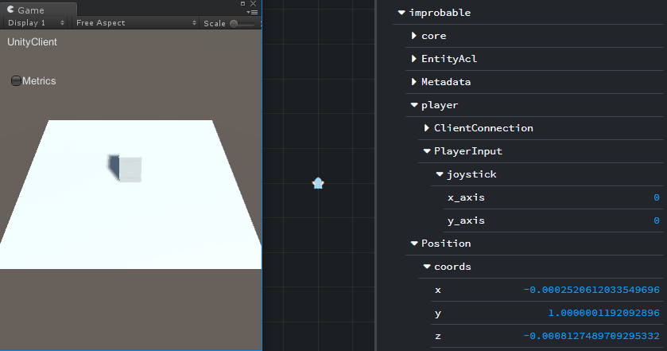
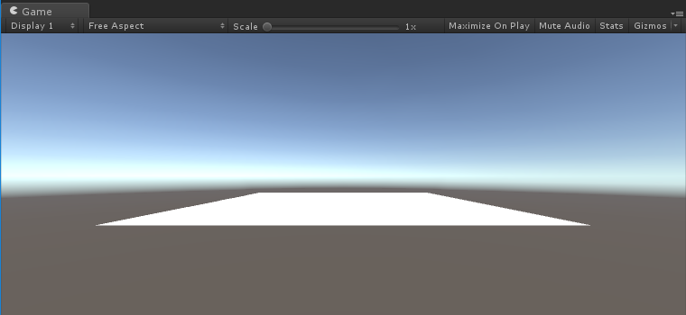
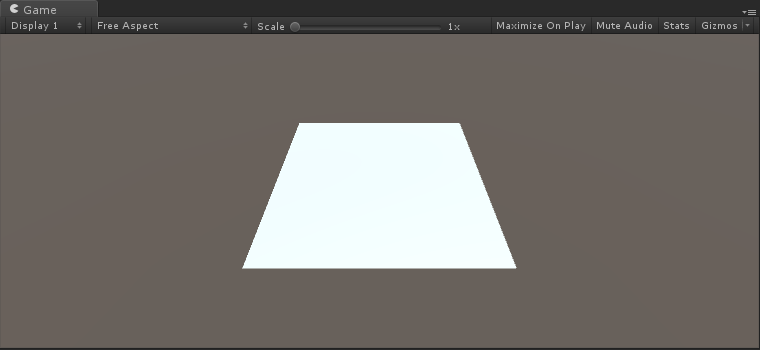
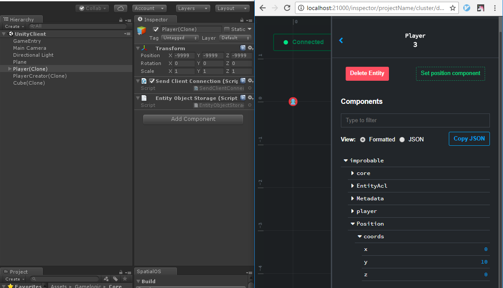
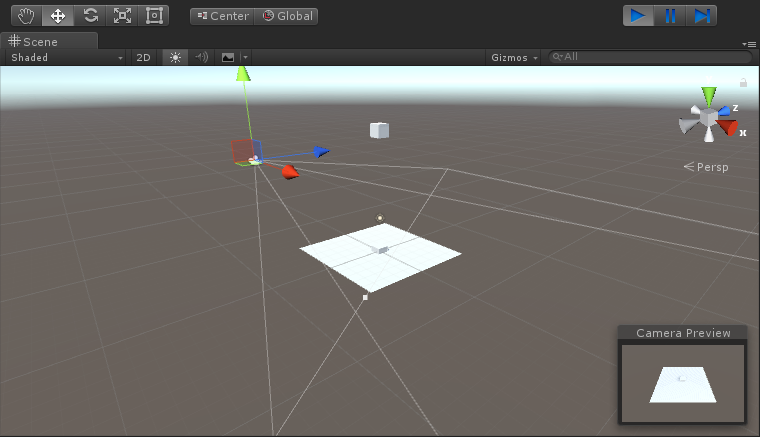
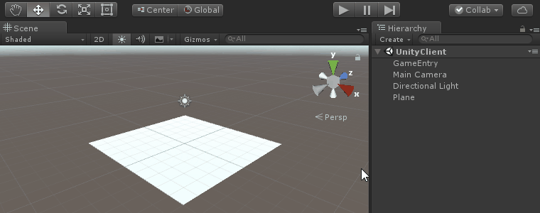
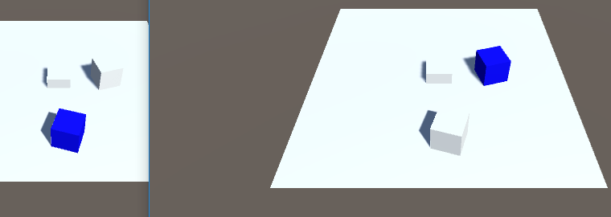

# Player movement in Unity

This recipe will teach you how to design and implement basic player movement in Unity for a SpatialOS game. We will talk about making player movement server-authoritative. Client-side prediction is out of scope for this recipe.

Using the [Unity Starter Project](https://github.com/spatialos/StarterProject) as a starting point for this recipe is encouraged. Remember to run `spatial worker build` to generate the helper classes.



## About server-authoritative games

In networking, to be “authoritative” means to have control. In order for a multiplayer game to be server-authoritative, it must prevent players from making illegal changes to the game state (a.k.a cheating).

Players shouldn’t be able to freely update their position. Instead, clients send input to the server (keystrokes, target position, actions), the server executes some logic or simulation which depends on player input, and lets clients know about the new game state, so that they can render it for the players.

The main down-side of the server-authoritative model is that it introduces latency to the result of players’ actions. This can be mitigated by the use of client-side prediction.

## Making server-authoritative games for SpatialOS

By design, only one worker at a time can be authoritative over an entity’s component (remember that clients are a type of worker). In this recipe, a player’s Position component will be editable by a single server worker at a time. The rest of the workers might have read access, or might not even know the player exists at all — an entity doesn’t get checked out by a worker unless SpatialOS decides the entity is of [interest (SpatialOS documentation)](https://docs.improbable.io/reference/13.0/shared/glossary#interest) to that particular worker.

Each client worker will be sharing their player’s input through a client-authoritative component. In this recipe, the component is named PlayerInput, but you can call it something else if you like, nor is it mandatory to aggregate all the input into the same component. The server worker authoritative over their Player will read the input stored in the component to take the appropriate actions for the player — in this case, moving them.

When building an entity, e.g. in the entity templates in `Gamelogic/EntityTemplates/EntityTemplateFactory.cs`, specify `PhysicsOnly` for those components that should only be editable by server-side workers. Otherwise, you probably want to use `SpecificClientOnly(clientId)` to restrict editing to the client that “owns” the entity. Read the [”Access control lists” (SpatialOS documentation)](https://docs.improbable.io/reference/13.0/shared/glossary#acl) guide for more information.

```c#
public static Entity CreatePlayerCreatorTemplate()
{
    var playerCreatorEntityTemplate = EntityBuilder.Begin()
        .AddPositionComponent(Improbable.Coordinates.ZERO.ToUnityVector(), CommonRequirementSets.PhysicsOnly)
        [...]
        .AddComponent(new PlayerInput.Data(new Joystick(0, 0)), CommonRequirementSets.SpecificClientOnly(clientId))
    [...]
}
```

## 1. Initial scene setup

### 1.1 Adding a platform



- Open the `UnityClient` scene.

- Select `GameObject > 3D Object > Plane` to create a new Plane GameObject, which will be the platform where your players will be resting on. Planes come with a Mesh Collider component, which will prevent players from falling indefinitely. The plane should be at position (0, 0, 0) and scale (1, 1, 1): big enough as a play area, but small enough to be able to see the players falling off from the platform.

- Copy your Plane into the `UnityWorker` scene so that it is present in both worker scenes. GameObjects placed in a worker scene (i.e. `UnityClient` or `UnityWorker`) will be built-out to appear as local-only GameObjects for that worker at runtime. By positioning an identical static plane in both the `UnityClient` and `UnityWorker` you implicitly allow both worker types to share a resource without having to transfer any information.

> You could have also used an Entity to represent the plane and sync it across workers, but in this case there’s no need for any of the benefits entities provide, so the “copy and paste” approach is simpler and more efficient.


### 1.2 Adjusting the Main Camera



- Go back to the `UnityClient` scene. The Main Camera is not giving you a good perspective of the platform. Update the Main Camera’s position to (0, 9, -10) and its rotation to (45, 0, 0).

### 1.3 Player Prefab setup

The Player Prefab currently only has a `Transform`, `Handle Client Connection` and `Send Client Connection` components — it has no geometry, so it won’t be visible on the clients, and it has no `Collider`. Let’s fix that.

- Drag the Player Prefab from `Assets/EntityPrefabs` in the Project pane into the scene.

- In the Hierarchy, right-click the Player and select 3D Object > Cube. This creates a Cube GameObject as a child of the Player GameObject. The Cube comes with a `Box Collider` component, which causes your Player to stand on the platform and to collide with other Players, potentially causing them to fall from the edge.

> An alternative option could be to add a `Mesh Filter`, a `Mesh Renderer`, and a `Collider`, to the Player Prefab itself, but adding the Cube as a child of the Player Prefab allows you to modify the Cube’s transform in relation to the Player’s origin, and it keeps your GameObjects tidy and simple.

- Select the Player GameObject and save its changes back to its Prefab (“Apply” button in the Inspector panel). You can tell you’ve correctly applied the changes since the Player Prefab preview in the Project pane will now show the cube.

- After you’ve applied the changes, delete the Player instance from the scene — Player GameObjects should only be instantiated in response to a player connection, so there shouldn’t be any on startup. To whom would it belong?

>  The Starter Project comes with a Cube entity that is spawned at the origin (0,0,0), which will be “stuck” inside the Plane. Don’t confuse this instance of the Cube prefab with a player.<br>

> Having this Cube (or “pedestal”) in the middle of the platform is interesting since thanks to it you’ll be able to easily test physics interactions besides falling off the platform. We suggest changing its material so that it’s harder to get them confused.


### 1.4 Modifying players’ spawn point

When clients join the game, [a server-side worker creates a Player entity for them](../../tutorials/recipes/client-lifecycle.md) using the Player entity template. The Player entity template currently specifies that the starting value for the Position component is (0, 0, 0). You are going to make players appear in the sky so that they fall on top of the platform.

- In `Gamelogic/Core/SimulationSettings.cs`, add a constant for the spawn point’s height:

```c#
public static class SimulationSettings
{
    public static readonly float PlayerSpawnHeight = 10;
    [...]
}
```

- The Player entity template is defined at `Gamelogic/EntityTemplates/EntityTemplateFactory.cs` file. In the `CreatePlayerTemplate` function, modify the Position component’s initial data to use your new constant instead. Check you are modifying the correct template.

```c#
public static Entity CreatePlayerTemplate(string clientId)
{
    var playerTemplate = EntityBuilder.Begin()
        .AddPositionComponent(new Improbable.Coordinates(0, SimulationSettings.PlayerSpawnHeight, 0).ToUnityVector(), CommonRequirementSets.PhysicsOnly)
        [...]
        .Build();

    return playerTemplate;
}
```

If you [build and run](../../develop/build.md#quick-reference), you should see an instance of the Player prefab, `Player(Clone)`, in Unity’s Hierarchy panel. This GameObject is linked to your Player entity, which has been created in response to your connection, as described in the [Client connection lifecycle](../../tutorials/recipes/client-lifecycle.md) recipe.

If you inspect your Player entity using the [SpatialOS Inspector (SpatialOS documentation)](https://docs.improbable.io/reference/13.0/shared/glossary#inspector), you can see that its Position component has a value of `(0,10,0)` (which is the entity’s default position, as described in its entity template), whereas if you inspect its associated GameObject (`Player(Clone)`) in Unity’s Inspector, you can see that its Transform has a value of `(-9999,-9999,-9999)` (which is the default position for Spatial-instanced GameObjects).



The two positions don’t match because the Player prefab is lacking a script that syncs the Entity’s position to the GameObject’s position. You’ll be adding this script in the next section.

## 2. Server-authoritative physics

In the server-authoritative model, physics will be running on the server, and their results will be recorded in the Position and Rotation components of those Entities that are involved. Client workers will apply the updates for each entity to the GameObjects that represent them, which will be used to render the world state.

- Add the existing `TransformReceiver.cs` script to your Player Prefab (it comes bundled with the Starter Project). This script listens for changes in the Player Entity’s Position and Rotation components and updates the GameObject’s transform accordingly. It doesn’t apply the updates if the worker has authority over the components, since it’s pointless for it to apply its own updates.

```c#
using Assets.Gamelogic.Utils;
using Improbable;
using Improbable.Core;
using Improbable.Unity.Visualizer;
using UnityEngine;

namespace Assets.Gamelogic.Core
{
    public class TransformReceiver : MonoBehaviour
    {
        [Require] private Position.Reader PositionReader;
        [Require] private Rotation.Reader RotationReader;

        void OnEnable()
        {
            transform.position = PositionReader.Data.coords.ToUnityVector();
            transform.rotation = RotationReader.Data.rotation.ToUnityQuaternion();
        }

        void Update()
        {
            if (PositionReader.Authority == Authority.Authoritative)
            {
                transform.position = PositionReader.Data.coords.ToUnityVector();
                transform.rotation = RotationReader.Data.rotation.ToUnityQuaternion();
            }
        }
}
```

If you [build and run](../../develop/build.md#quick-reference), you should see that the Player's GameObject is correctly positioned at `(0,PlayerSpawnHeight,0)` thanks to the `TransformReceiver.cs` script. Note that the chosen spawn point is above the camera's frame, so you won't be able to see the Player until gravity causes it to go down. But gravity currently doesn't affect the Player because it doesn't have a Rigidbody.



- Add a Rigidbody component to your Player Prefab. It is required so that Unity’s physics engine takes over its motion. Inside each worker, gravity will make Player GameObjects fall, but the effects of physics will not be reflected in the entity’s state until you have a script that updates the entity’s Position and Rotation components.

- Create a script named `TransformSender.cs` inside `Gamelogic/Core`. This script will be executed in the server worker that is authoritative over the Player’s Position and Rotation components. It continuously updates the entity’s position and rotation so that the effects of the physics engine are reflected in the entity’s state.

  ```c#
  using Assets.Gamelogic.Utils;
  using Improbable;
  using Improbable.Core;
  using Improbable.Unity;
  using Improbable.Unity.Visualizer;
  using UnityEngine;

  [WorkerType(WorkerPlatform.UnityWorker)]
  public class TransformSender : MonoBehaviour
  {

      [Require] private Position.Writer PositionWriter;
      [Require] private Rotation.Writer RotationWriter;

      void Update ()
      {
          var pos = transform.position;
          var positionUpdate = new Position.Update()
              .SetCoords(new Coordinates(pos.x, pos.y, pos.z));
          PositionWriter.Send(positionUpdate);

          var rotationUpdate = new Rotation.Update()
              .SetRotation(MathUtils.ToNativeQuaternion(transform.rotation));
          RotationWriter.Send(rotationUpdate);
      }
  }
  ```

- Add the `TransformSender.cs` script to the Player Prefab.

If you [build and run](../../develop/build.md#quick-reference), your client should visualize the cube falling from the sky on top of the platform. If you check the simulation state in the SpatialOS Inspector, you’ll see that your Player’s `y` coordinate is approximately `1`.

As you can see in the gif, you are unable to modify the position of the Player GameObject because the `TransformReceiver.cs` script is continuosly repositioning it using the entity's Position data.



## 3. Server-authoritative player movement

### 3.1 Collecting player input

A new Spatial Component is needed to hold the player’s input state. There are multiple options to represent player input for movement. For example, you could:

- send the state of a couple of keys as booleans,
- send a target position to move towards, or
- send a direction vector whose magnitude represents a fraction of the maximum player speed.

The latter will be implemented because it allows for fine-grained movement using a physical or on-screen joystick. It’s also simpler to implement in Unity thanks to `Input.GetAxis(...)`.

- Create a file named `PlayerInput.schema` inside `schema/improbable/player`. Paste the following schema into it:

    ```
    package improbable.player;
     
    type Joystick {
        float x_axis = 1;
        float y_axis = 2;
    }
     
    component PlayerInput {
        id = 1004;
        Joystick joystick = 1;
    }
    ```
- Open the [SpatialOS window](../../reference/spatialos-window.md), go to the `Build` tab, and under `Generate from schema`, click `Build`. It will generate the C# helper classes for the new schema.

- Add the new PlayerInput Spatial Component to the Player entity template in `Gamelogic/EntityTemplayes/EntityTemplateFactory.cs`. `SpecificClientOnly(clientId)` declares that the only worker that can write to the PlayerInput component is the specific client for which a Player entity is being built. Check you are modifying the correct template.

    ```c#
    public static Entity CreatePlayerTemplate(string clientId)
    {
    	var playerTemplate = EntityBuilder.Begin()
    		[...]
            .AddComponent(new ClientAuthorityCheck.Data(), CommonRequirementSets.SpecificClientOnly(clientId))
            .AddComponent(new ClientConnection.Data(SimulationSettings.TotalHeartbeatsBeforeTimeout), CommonRequirementSets.PhysicsOnly)
            .AddComponent(new PlayerInput.Data(new Joystick(xAxis: 0, yAxis: 0)), CommonRequirementSets.SpecificClientOnly(clientId))
            .Build();

        return playerTemplate;
    }
    ```

- Create a script named `PlayerInputSender.cs` inside `Gamelogic/Player` - it will continuously update the PlayerInput component with the current input state. Since it requires a `PlayerInput.Writer`, this script will only get enabled on `UnityClient`s, for the Player GameObject that belongs to them.

    ```c#
    using UnityEngine;
    using Improbable.Unity;
    using Improbable.Unity.Visualizer;
    using Improbable.Player;

    [WorkerType(WorkerPlatform.UnityClient)]
    public class PlayerInputSender : MonoBehaviour
    {

        [Require] private PlayerInput.Writer PlayerInputWriter;

        void Update ()
        {
            var xAxis = Input.GetAxis("Horizontal");
            var yAxis = Input.GetAxis("Vertical");

            var update = new PlayerInput.Update();
            update.SetJoystick(new Joystick(xAxis, yAxis));
            PlayerInputWriter.Send(update);
        }
    }
    ```

- Add the to the `PlayerInputSender.cs` script to the Player Prefab.

If you [build and run](../../develop/build.md#quick-reference), your Player shouldn’t be able to move yet, but you should be able to cause changes in the PlayerInput Component’s state using the arrow keys. You can observe those changes in the SpatialOS Inspector.


### 3.2 Moving the player

In `Gamelogic/Core/SimulationSettings.cs`, add a constant for player acceleration:

```c#
public static class SimulationSettings
{
    public static readonly float PlayerSpawnHeight = 10;
    public static readonly float PlayerAcceleration = 15;
    [...]
}
```

- Create a script named `PlayerMover.cs` inside `Gamelogic/Player`.

    This script will only be used by server-side workers (since it requires Position and Rotation writers, and has a `[WorkerType(WorkerPlatform.UnityWorker)]` annotation) and uses the Players’ PlayerInput data to move their rigidbody. Any resulting changes caused by Unity’s physics engine are then written back into their Position and Rotation components.

```c#
using Assets.Gamelogic.Core;
using Assets.Gamelogic.Utils;
using Improbable;
using Improbable.Core;
using Improbable.Player;
using Improbable.Unity;
using Improbable.Unity.Visualizer;
using UnityEngine;

[WorkerType(WorkerPlatform.UnityWorker)]
public class PlayerMover : MonoBehaviour {

    [Require] private Position.Writer PositionWriter;
    [Require] private Rotation.Writer RotationWriter;
    [Require] private PlayerInput.Reader PlayerInputReader;

    private Rigidbody rigidbody;

	void OnEnable ()
  {
        rigidbody = GetComponent<Rigidbody>();
	}

	void FixedUpdate ()
  {
        var joystick = PlayerInputReader.Data.joystick;
        var direction = new Vector3(joystick.xAxis, 0, joystick.yAxis);
        rigidbody.AddForce(direction * SimulationSettings.PlayerAcceleration);

        var pos = rigidbody.position;
        var positionUpdate = new Position.Update()
            .SetCoords(new Coordinates(pos.x, pos.y, pos.z));
        PositionWriter.Send(positionUpdate);

        var rotationUpdate = new Rotation.Update()
            .SetRotation(rigidbody.rotation.ToNativeQuaternion());
        RotationWriter.Send(rotationUpdate);
	}
}
```

- Add the `PlayerMover.cs` script to the Player Prefab.

If you [build and run](../../develop/build.md#quick-reference), you should be able to use the arrow keys to move your cube around. Since `PlayerInputSender.cs` is using Unity’s `Input.GetAxis("Horizontal")`, you should also be able to move using a gamepad, which allows finer control.


Follow the [Deploy a project (SpatialOS documentation)](https://docs.improbable.io/reference/13.0/shared/deploy/deploy-cloud) guide to deploy your game to the cloud – great for testing your game with friends thanks to our [Launcher (SpatialOS documentation)](https://docs.improbable.io/reference/13.0/shared/operate/launcher)! You can also launch another local client using `spatial local worker launch UnityClient default`.

> During testing, you may experience an interesting case where the objects on top
of the platform disappear. This will happen when your player falls off from the platform towards some direction.

> When the player gets too far away from the platform (`x` and `z` wise), your client stops checking out the entities
on top of it, because they no longer fall within the [interest (SpatialOS documentation)](https://docs.improbable.io/reference/13.0/shared/glossary#interest) radius of
your player.

### 3.3 Be careful with player input

One can be misled to believe that their game’s player movement is now secure since players are only sending input. Don’t forget to sanitize the input you are receiving, otherwise you might be leaving doors open to cheating.

In `PlayerMover.cs`, joystick data is being used as-is, without performing checks. The expected value for the joystick axis is a float between `-1.0` and `1.0`. However, there is no check asserting the values sent by the player fall within the range – a malicious client could send `(1000, 0)` as their joystick data, which would cause their player to move _very_ fast.

The fix in this case is to check the [magnitude](https://docs.unity3d.com/ScriptReference/Vector3-magnitude.html) of the `direction` vector, and to [normalize](https://docs.unity3d.com/ScriptReference/Vector3.Normalize.html) the vector in case its magnitude is bigger than `1`.

```c#
void FixedUpdate ()
{
    var joystick = PlayerInputReader.Data.joystick;
    var direction = new Vector3(joystick.x, 0, joystick.y);
    if (direction.sqrMagnitude > 1)
    {
        direction.Normalize();
    }
    rigidbody.AddForce(direction * SimulationSettings.PlayerAcceleration);
    [...]
}
```

Before this check was in place, you could modify the client’s code to take advantage of the vulnerability. Here’s an example modification of `PlayerInputSender.cs` that would cause your player to move faster:

```c#
void Update ()
{
    var speedMultiplier = 10;
    var xAxis = Input.GetAxis("Horizontal") * speedMultiplier;
    var yAxis = Input.GetAxis("Vertical") * speedMultiplier;T

    var update = new PlayerInput.Update();
    update.SetJoystick(new Joystick(xAxis, yAxis));
    PlayerInputWriter.Send(update);
}
```

### 3.4 Disabling client-side physics

At this point, the game is simulating physics both on client and server workers. There’s only two reasons why you’d run physics on the client:

- your player’s position is client-side authoritative, and your player can be affected by physics. You run client-side physics so that your player collides with walls, gets pushed by objects, falls from cliffs, etc.

- you use physics as part of your client-side prediction.

Neither case applies in this recipe, therefore physics are being pointlessly run on the client. It may also result in jitter on the GameObjects when the local position gets reconciled with the actual server-authoritative position.

The fix is simple: disable physics for those GameObjects whose Entity’s Position Component you are not authoritative over.

In Unity, you disable physics on a rigidbody by setting its `isKinematic` property to `true`.

- In the Player Prefab’s Rigidbody component, check the `IsKinematic` property. GameObjects will have physics disabled by default, and they will be enabled when the worker has authority over their Position component.

- Create a script named `PhysicsEnabler.cs` inside `Gamelogic/Core`.

```c#
using Improbable;
using Improbable.Unity.Visualizer;
using System.Collections;
using System.Collections.Generic;
using UnityEngine;
using System;

public class PhysicsEnabler : MonoBehaviour
{

    [Require] private Position.Writer PositionWriter;

    private void OnEnable()
    {
        SetPhysicsEnabled(true);
    }

    private void OnDisable()
    {
        SetPhysicsEnabled(false);
    }

    private void SetPhysicsEnabled(bool physicsEnabled)
    {
        GetComponent<Rigidbody>().isKinematic = !physicsEnabled;
    }
}
```

- Add the `PhysicsEnabler.cs` script to the Player Prefab.

You can debug it works by inspecting any `Player(Clone)` GameObjects and examining their Rigidbody component. Clients don’t have authority over any of the players’ Position component, so their physics should be disabled, meaning `isKinematic` should be true.

## Tip: Visually identifying your player



- Drag the Player Prefab into the scene.

- Create a script named `MyPlayerHighlighter.cs` inside `Gamelogic/Player`. Because of the `PlayerInput.Writer` require, the script will only be enabled on the Player that belongs to the client, effectively highlighting the client’s Player.

```c#
using Improbable.Player;
using Improbable.Unity.Visualizer;
using UnityEngine;

public class MyPlayerHighlighter : MonoBehaviour
{

    [Require] private PlayerInput.Writer PlayerInputWriter;

    [SerializeField] private GameObject playerBody;

    private void OnEnable()
    {
        playerBody.GetComponent<Renderer>().material.color = Color.blue;
    }
}
```

- Add the `MyPlayerHighlighter.cs` script to the Player GameObject.

- Assign the Cube GameObject inside the Player to the `playerBody` field of the `My Player Highlighter` component in the inspector.

- Make sure to save changes back to the Prefab, and to delete the Player GameObject from the scene!

## Conclusion

You should now be able to add server-authoritative movement to players in response to their input.

## Make it better

- Add [client-side prediction](http://www.gabrielgambetta.com/client-side-prediction-server-reconciliation.html) to the Player GameObjects.

- `TransformSender.cs` could be optimized to only send updates when the change is significant, as done in the [VRStarterProject](https://github.com/spatialos/VRStarterProject/blob/master/workers/unity/Assets/Gamelogic/Global/TransformSender.cs).

- If you want to turn this recipe into a game, e.g. “CubeSumo”, here’s a few ideas:

    - **Jumping**. You can implement it using [events (SpatialOS documentation)](https://docs.improbable.io/reference/13.0/shared/glossary#event), or by syncing the state of a key as a `bool`.
    - **Player respawning**. Players respawn when they fall off the platform.
    - **Lives**. Players have a limited amount of lives, which is displayed somehow, and decreased every time a player needs to be respawned.
    - **Usernames**. An [Input Field](https://docs.unity3d.com/Manual/script-InputField.html) and [Button](https://docs.unity3d.com/ScriptReference/UI.Button.html) to set your own username. You can implement the request using [commands (SpatialOS documentation)](https://docs.improbable.io/reference/13.0/shared/glossary#command).

## Relevant recipes

- [Client connection lifecycle](../../tutorials/recipes/client-lifecycle.md), to better understand how clients connect to SpatialOS and how the Player Entity and its GameObject are created.

- [Player camera visualisation in Unity](../../tutorials/recipes/player-visualization.md), for controlling the player’s view and orientation.

- [Create an entity in Unity](../../tutorials/recipes/entity-creation.md), to add further functionality to your game.
